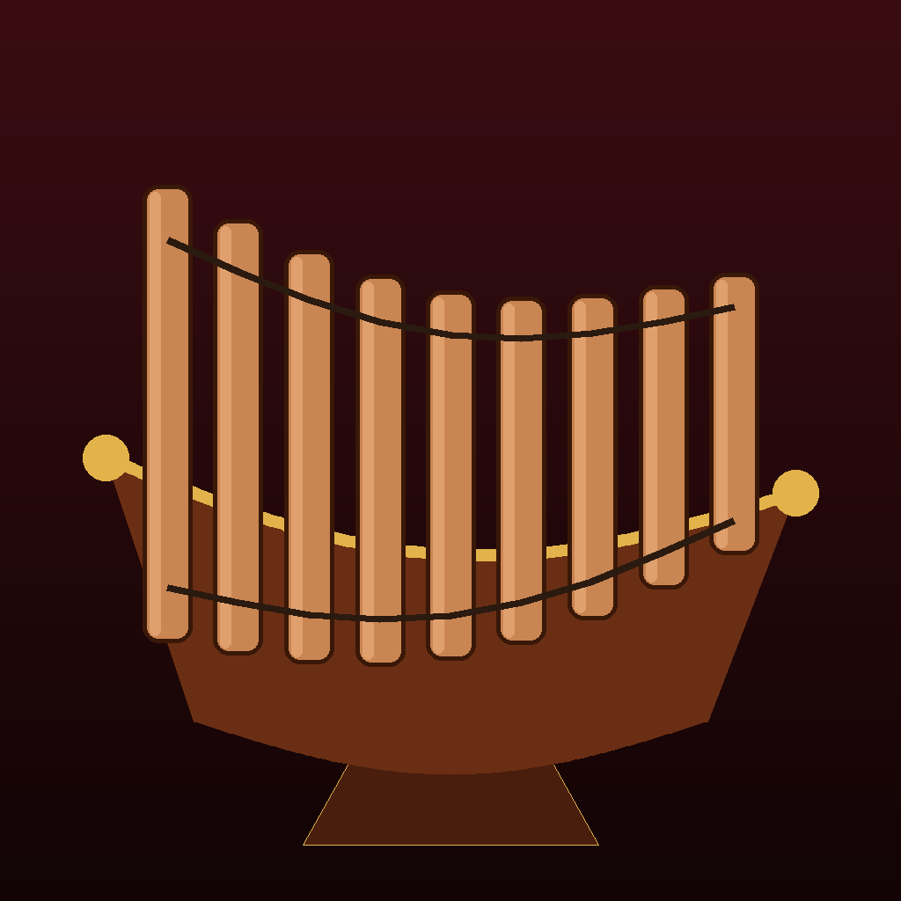

# Ranad — ระนาดเอก

An iOS app for playing the Thai **ranad ek** (ระนาดเอก), the lead xylophone of the piphat ensemble.

## Features

- **22 bars** in the ranad ek scale ช ล ท ด ร ม ฟ, three times over plus a fourth ช on top. The bars are all the same length and sit side by side, lowest on the left, so every bar is an easy target.
- **Multi-touch**: every finger is a mallet. Tap to strike, slide across the bars for a glissando.
- **Kro (กรอ)**: turn it on and hold a bar to roll the rapid tremolo that is typical of ranad playing.
- **Octaves (ตีคู่แปด)**: every strike also plays the bar an octave away, the way ranad players usually play with two mallets.
- **Thai or Western tuning**: Thai tuning splits the octave into seven equal steps. Western tuning starts on G, for playing along with other instruments.
- Note labels in Thai (ช ล ท ด ร ม ฟ) or Latin (Sol La Ti Do Re Mi Fa), or none.
- No audio samples: each note is rendered from a physical model of a struck ranad bar. The model covers the bar's resonant modes with its strong bright overtone, a hard-mallet strike, the wooden "tak" of the hit, and the knock of the wooden body. A small room reverb is added on top.
- The web version (`web/ranad.html`) is the same instrument and runs in a phone browser. It adds a Sound panel for tuning the sound by ear, and it can play a recording of a real ranad note on every bar.

## Running it

Requires Xcode 16 or later, and iOS 17 or later.

1. Open `Ranad.xcodeproj` in Xcode.
2. Select the **Ranad** target → *Signing & Capabilities*, and choose your team. You may also need to change the bundle identifier from `com.example.ranad`.
3. Pick your iPhone or iPad (or a simulator) and press **Run**.

The app runs in landscape only. Sound plays even when the silent switch is on.

## Code

| File | What it does |
| --- | --- |
| `RanadInstrument.swift` | Tuning, note names, and the bar geometry shared by drawing and touch handling |
| `RanadAudioEngine.swift` | `AVAudioEngine` setup, the ranad bar model, and the real-time note mixer |
| `TouchSurface.swift` | Multi-touch handling (strikes, glissando, kro tremolo) |
| `RanadViewModel.swift` | Settings and state for which bars are lit |
| `ContentView.swift` | The SwiftUI instrument and controls |
